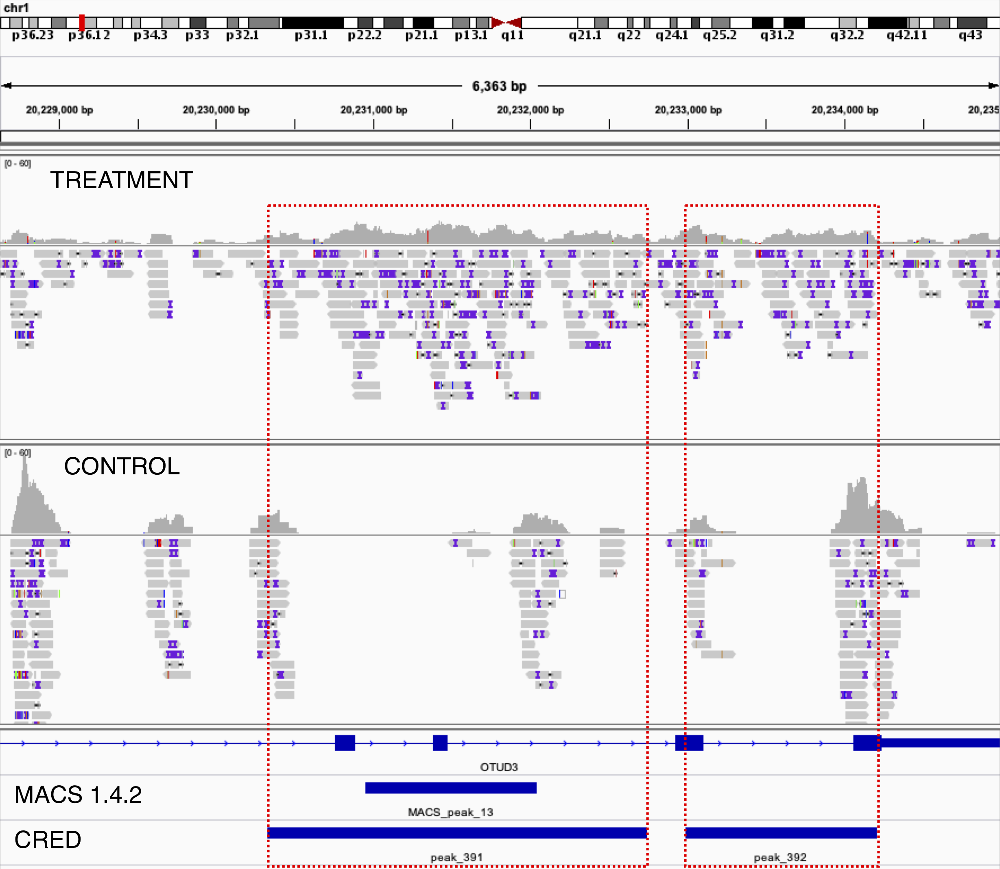

# Background
Chem-Seq Read Enrichment Discovery (CRED) is a rapid peak caller written in C for next-generation sequencing (NGS) data, particularly designed with analyzing affinity-enrichment sequencing experiments with pyrrole-imidazole polyamides. Pyrrole-imidazole (PI) polyamides are synthetic molecules, which have primary sequences composed of N-methylpyrrole and N-methylimidazole subunits. These molecules are highly sequence-specific DNA minor-groove binders, but as a consequence of their relatively short recognition motif and molecular weight, the resultant sequencing data often showed a mixture of broad and narrow peaks atypical of other NGS experiments. This fact likely was due to the smaller binding surface in polyamide-DNA interactions compared to their protein-DNA counterparts. We previously designed and reported a workflow to characterize genomic sites enriched with PI polyamide-bound DNA fragments, but the approach required extended preprocessing to convert aligned reads to BED files; additionally, the performance and post-processing of the output unnecessarily lengthened the workflow and hindered throughput. Such shortcomings necessitated computational improvements that remain unmet in the field of Chem-seq research.

# Overview
Despite that various peak callers for analyzing NGS data exist, most embrace the philosophy that peaks could be modeled as Poisson scattering events; while this approach works well in most ChIP-seq cases, various publications have reported deficiencies of this algorithm in applications such as DNase-seq.

In our research of pyrrole-imidazole polyamides, a class of DNA minor-groove binders, we have also noticed that MACS [@Zhang2008], a popular model-based peak caller, suffered from similar issues in the analysis of affinity-enriched DNA fragments sequenced by Ion Torrent systems (a method we hereafter will refer as "Chem-seq"). We previously proposed a coverage-based approach [@Lin2016], in which we employed Perl-based diffReps [@Shen2013] as the initial candidate selection component, followed by bootstrapped Kolmogorov-Smirnov comparisons to characterize Chem-seq peaks.

This workflow, however, required extensive pre- and post-processing of data, as Perl lacked a direct library to access sequencing data stored in BAM files, a format standard shared by various short-read aligners and NGS tools. While the popular BioPerl package included APIs for processing BAM files, the large amount of dependencies (most of which being unrelated to the workflow) and the size of the BioPerl library made it an undesirable for implementation. There were also performance issues associated with external system calls and the reliance on R to perform more complex mathematical computations.

CRED tries to address the aforementioned shortcomings by streamlining the existing workflow. We chose to develop CRED in C to take advantage of HTSlib, a native C library for processing NGS data [@Li2009]. Access to HTSlib led to time savings in data preprocessing, as the program could now accept BAM files as direct inputs. Writing the program in C also provided performance improvements in computation, and overall eliminated the need to rely on R, along with the associated need to save and retrieve intermediate output.

*Figure*: ``Example of a Chem-seq site by CRED and MACS in Integrated Genome Viewer (IGV).`` LS180 cells were treated with either a 9-bp biotinylated PI polyamide ("treatment") or DMSO ("control") and affinity precipitated with streptavidin. After Ion Torrent sequencing, reads were aligned with TMAP, followed by peak calling with either MACS 1.4.2 or CRED. Regions boxed with red dotted lines indicate putative regions of positive enrichment identified by CRED; Top track, treatment; bottom track, control.

CRED accepts a pair of treatment ('pulldown') and control ('input') coordinate-sorted and indexed BAM files from Chem-seq experiments. The program then compiles a list of preliminary candidates and tests such regions against the hypothesis that there is significant enrichment compared to the same site in a control track, either via Welch's *t* [@Majumder1973] or Kolmogorov-Smirnov test [@Durbin1973]. The output is reported in a BED-like format to standard output, so they can be easily piped into a Perl array or R vector within a larger workflow script. This output format allows results to be easily visualized in genome browsers such as IGV and requires no additional reformatting. While designed with processing Chem-seq data in mind, CRED may also be compatible with other NGS applications in cases where reads may be too heterogenous to fit a strict Poisson mixture model.

# Acknowledgement
This work was supported by Grant-in-Aids for Scientific Research B and for Young Scientists B from Japan Society for the Promotion of Science (JP17H03602 to HN and JP17K15047 to JL) as well as Japan Agency for Medical Research and Development (AMED, JP17cm0106510, JP17ck0106263 and JP17ck0106356 to HN; JP18ck0106422 to HN and JL). High-performance computing was provided by the Institute of Medical Science at the University of Tokyo as well as AIST Artificial Intelligence Research Center, courtesy of PH. We would also like to thank Prof. Seiya Imoto at the Institute of Medical Science, the University of Tokyo, for providing supercomputing support and technical advice on Chem-seq. JL held a visiting appointment at AIST for the duration of this project.

# References